# XL Release Skytap Plugin

## Preface
This document describes the functionality provide by the `xlr-skytap-plugin`

## Overview
This module offers a basic interface to Skytap functionality.

## Installation
Copy the plugin JAR file into the `SERVER_HOME/plugins` directory of XL Release.

## Skytap Authentication
Configures the credentials used to authenticate with the Skytap REST API. You should use the API security token shown on your [account](https://cloud.skytap.com/account) as the password. 
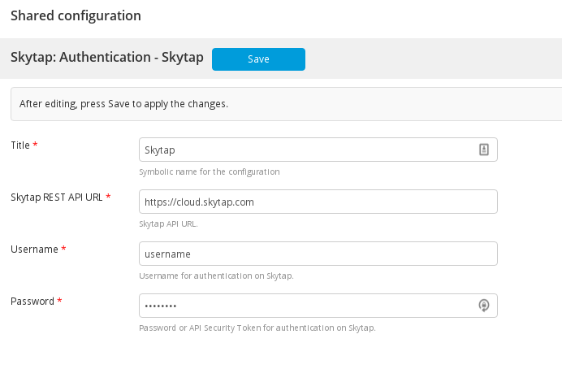

## Available Tasks
The available tasks for interfacing with Skytap. These tasks utilize the Skytap REST API and the provided Skytap Authentication Configuration.

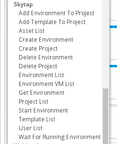

#### Add Environment To Project 
Adds the specified Environment to the specified Project.

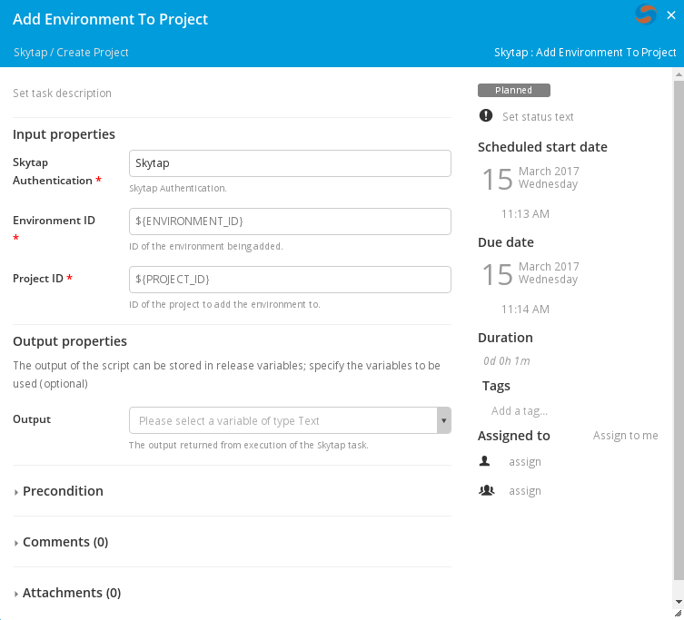

#### Add Template To Project 
Adds the specified Template to the specified Project.

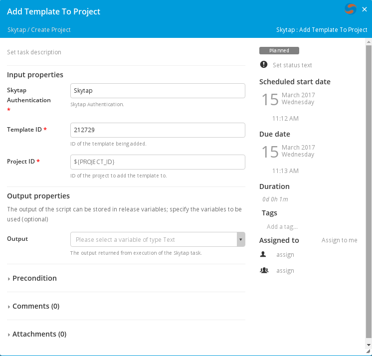

#### Asset List 
Lists the Assets visible to the authenticated user.

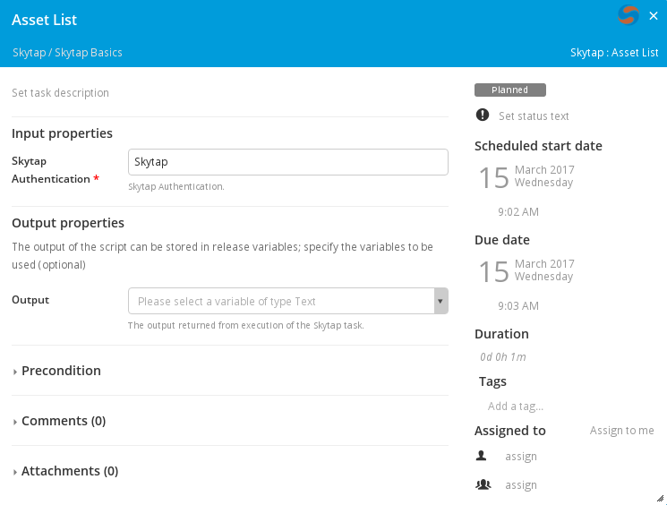

#### Create Environment 
Creates an Environment from the specified Template ID. Optionally you can specify a Project ID to add the Environment to.

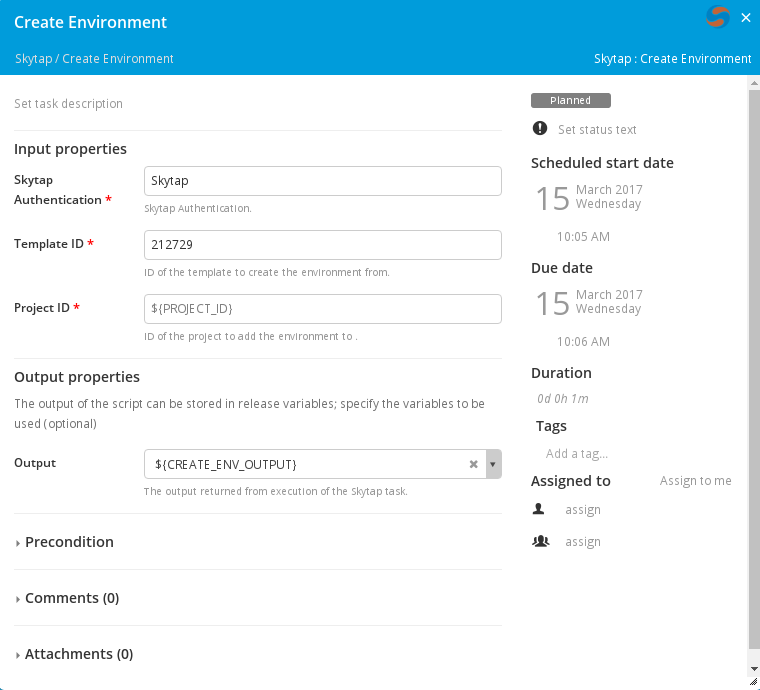

#### Create Project
Creates a Project with the specified name.

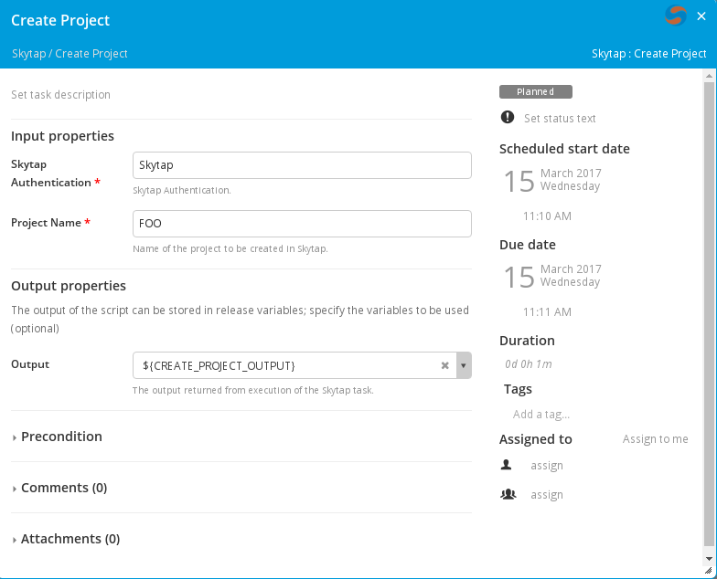

#### Delete Environment
Deletes the specified Environment.

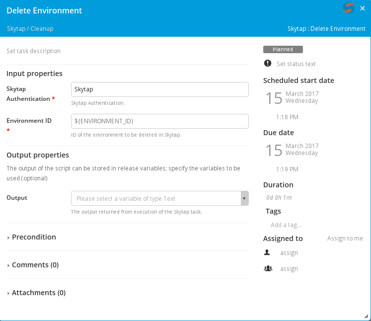

#### Delete Project
Deletes the specified Project.

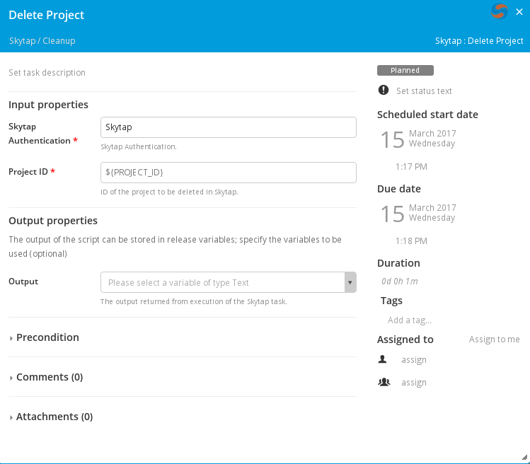

#### Environment List
Lists the Environments visible to the authenticated user.

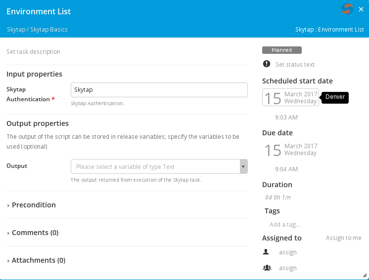

#### Environment VM List
Lists the VMs for the specified Environment.

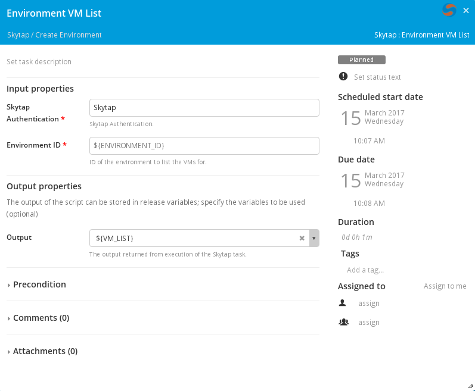

#### Get Environment
Get the details of the specified Environment.

#### Project List
Lists the Projects visible to the authenticated user.

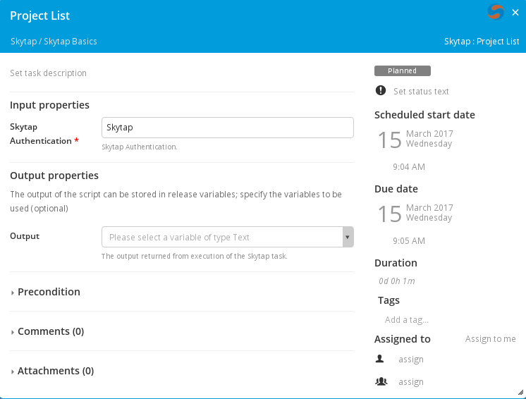

#### Start Environment
Starts the VMs in the specified Environment.

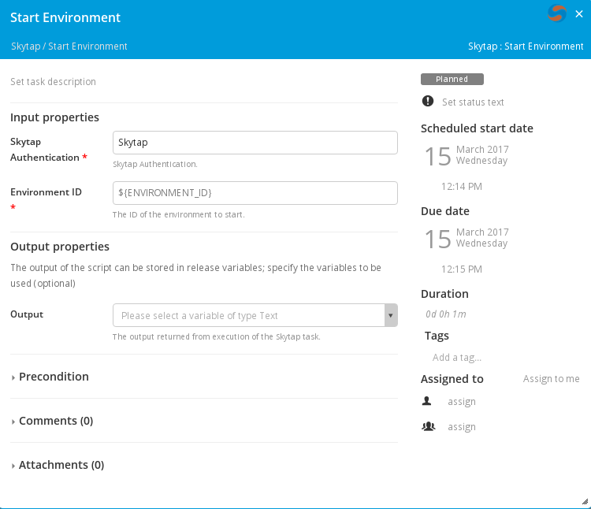

#### Template List
Lists the Templates visible to the authenticated user.

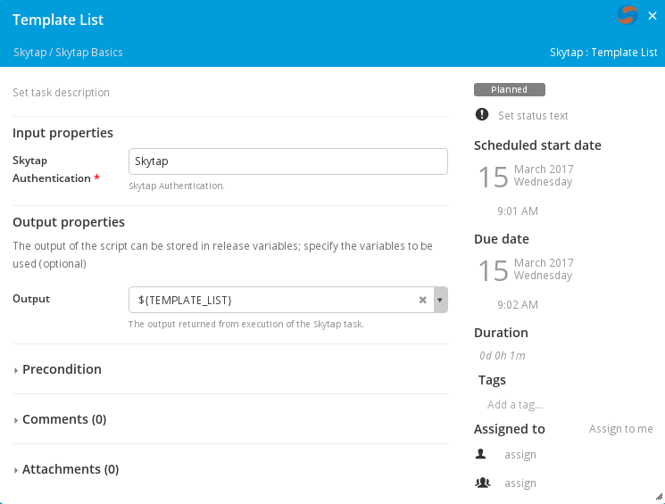

#### User List
Lists the Users visible to the authenticated user.

---

## Development
There is a basic Skytap Authentication configuration as well as a XL Release Template leveraging the current Skytap functionality available in Docker. 
Execute: `./gradlew runDockerCompose` 

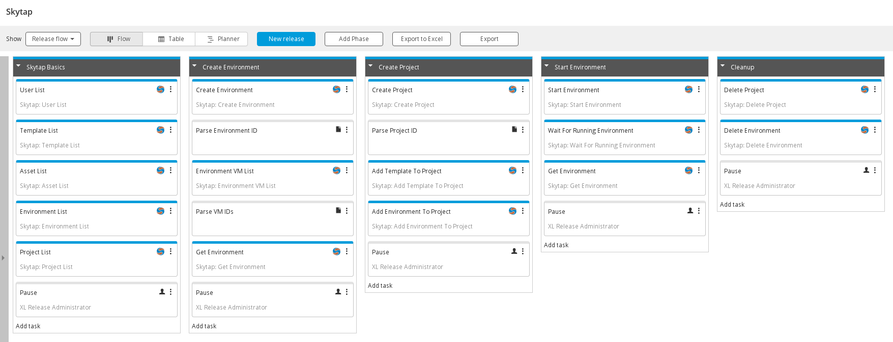

--- 

## References:
* [Skytap REST API](http://help.skytap.com/api.html)
